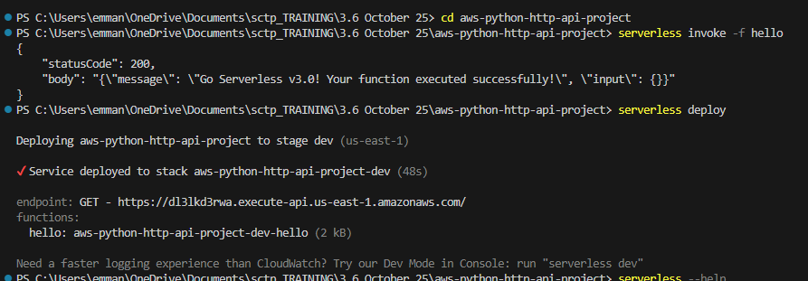
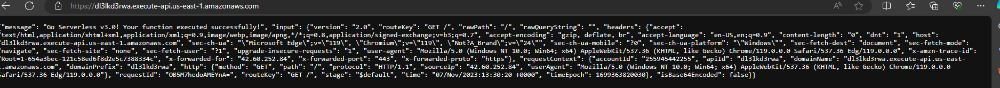
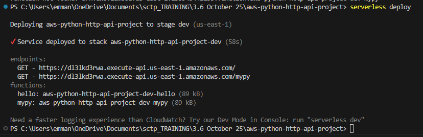
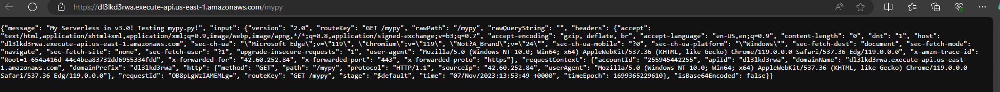

<!--
title: 'AWS Simple HTTP Endpoint example in Python'
description: 'This template demonstrates how to make a simple HTTP API with Python running on AWS Lambda and API Gateway using the Serverless Framework.'
layout: Doc
framework: v3
platform: AWS
language: python
authorLink: 'https://github.com/serverless'
authorName: 'Serverless, inc.'
authorAvatar: 'https://avatars1.githubusercontent.com/u/13742415?s=200&v=4'
-->

# Serverless Framework Python HTTP API on AWS

## Cloud-native-serverless-Assignment-3.5

### By emmanuel

